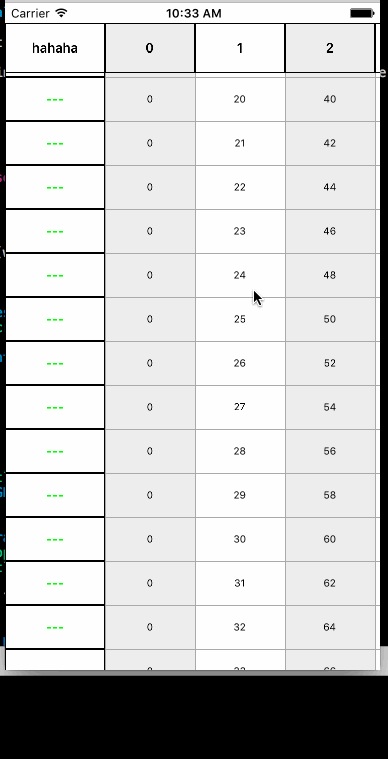

### 多列多行表格数据




* 视图结构


	 左上角标题 | 上标题1 | 上标题2 | 上标题...
	 -------- | ------- | ------ | ------
	左标题1  | C0R0 | C1R0 | CxR0...
	左标题2  | C0R1 | C1R1 | CxR1...
	左标题... | C0R... | C1R...| CxR...
	
	> 
    * 左上角标题是UILabel对象
    * 上面标题是UIScrollView上面放的是UILabels
    * 左标题是UITableView, Cell是UILabel
    * 右边CxRx 底层是UIScrollView, 对应每一列是UITableView, Cell是UILabel

	
	
* 使用示例

	``` Swift
	
	class ViewController: UIViewController, MultiColumnViewDatasource {

    override func viewDidLoad() {
        super.viewDidLoad()
        let columnView = MultiColumnView(frame: CGRect(x: 0, y: 20, width: view.bounds.width, height: view.bounds.height))
        columnView.datasource = self
        view.addSubview(columnView)
    }
    
    func leftTopTitle(mvc: MultiColumnView) -> String? {
        return "hahaha"
    }
    
    func leftTitles(mvc: MultiColumnView) -> [String]? {
        var array = [String]()
        for i in 0..<8 {
            array.append(String(i))
        }
        return array
    }
    
    func topTitles(mvc: MultiColumnView) -> [String]? {
        var array = [String]()
        for i in 0..<21 {
            array.append(String(i))
        }
        return array
    }
    
    func mainData(mvc: MultiColumnView) -> [[String]]? {
        var array = [[String]]()
        for i in 0..<20 {
            var a1 = [String]()
            for j in 0..<80 {
                a1.append(String(i*j))
            }
            array.append(a1)
        }
        return array
    }
}

	
	```


